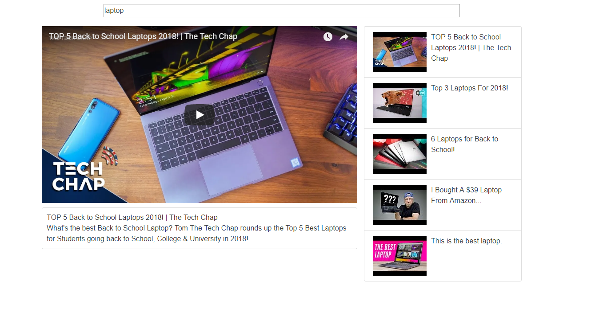

# YouTube_With_Working_Search_Bar_Using_React_And_API

#I recreated YouTube using React with Bootstrap and the YouTube API.

#The search bar functions updating the main video and the ones in the list to match the search term entered.

#To run the app clone the repository then navigate to the path where it is saved using the console/terminal and type npm install and press enter then type npm start and press enter.

#Then open your browser and enter the URL "http://localhost:8080/" in the address bar.

#The first screenshot shows how the site looks when just loaded with the default search term.

#The second screenshot shows how the site looks when laptop is typed into the search bar and shows the videos are updated.

